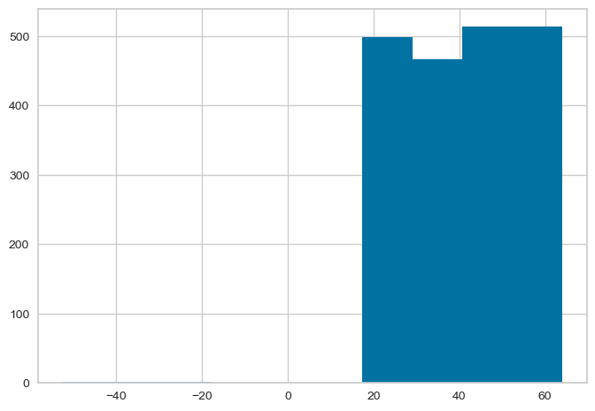
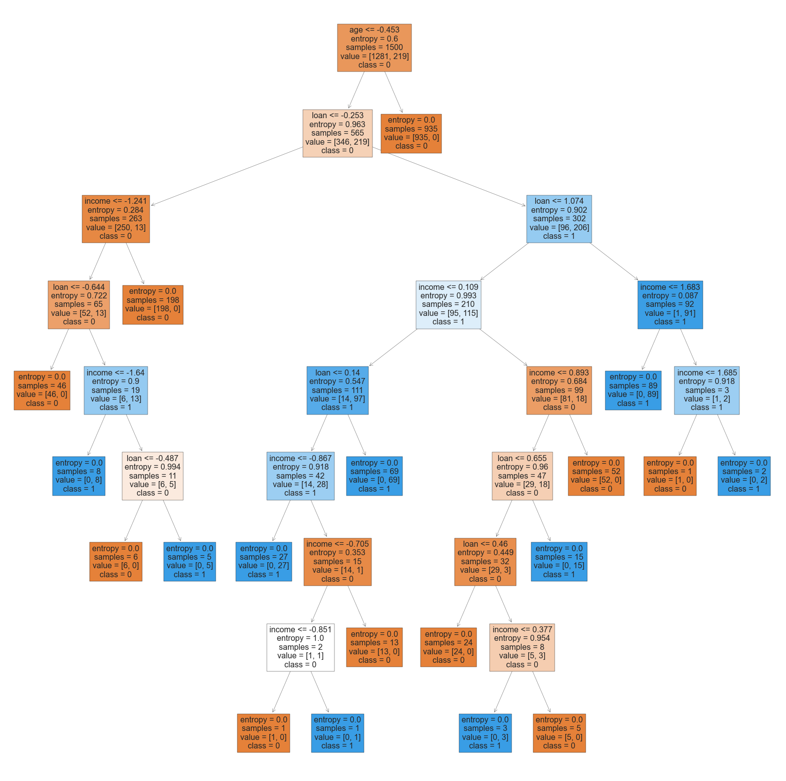

# Introdução

O objetivo desse projeto é prever se o cliente irá ou não pagar o empréstimo. Vale salientar que para essa base de dados, quando tiver "0" na coluna "default" quer dizer que o cliente pagou e quando tiver "1", quer dizer que o cliente não pagou o empréstimo. É um projeto de Classificação onde foi usados os seguintes modelos de Machine Learning: Naive Bayes, Árvore de Decisão, Random Forest, kNN, Regressão Logística, SVM e Redes Neurais.

# Importando Bibliotecas


```python
import pickle
import warnings
import pandas as pd
import numpy as np
import seaborn as sns
import matplotlib.pyplot as plt
import plotly.express as px
from yellowbrick.classifier import ConfusionMatrix
from sklearn.metrics import accuracy_score, confusion_matrix, classification_report
from sklearn.model_selection import train_test_split
from sklearn.preprocessing import StandardScaler
from sklearn.naive_bayes import GaussianNB
from sklearn.tree import DecisionTreeClassifier
from sklearn import tree
from sklearn.ensemble import RandomForestClassifier
from sklearn.neighbors import KNeighborsClassifier
from sklearn.linear_model import LogisticRegression
from sklearn.svm import SVC
from sklearn.neural_network import MLPClassifier
from sklearn.model_selection import GridSearchCV
from sklearn.model_selection import cross_val_score, KFold
```

# Carregando os Dados


```python
df = pd.read_csv('credit_data.csv')
```


```python
df
```


<div>
<style scoped>
    .dataframe tbody tr th:only-of-type {
        vertical-align: middle;
    }

    .dataframe tbody tr th {
        vertical-align: top;
    }

    .dataframe thead th {
        text-align: right;
    }
</style>
<table border="1" class="dataframe">
  <thead>
    <tr style="text-align: right;">
      <th></th>
      <th>clientid</th>
      <th>income</th>
      <th>age</th>
      <th>loan</th>
      <th>default</th>
    </tr>
  </thead>
  <tbody>
    <tr>
      <th>0</th>
      <td>1</td>
      <td>66155.925095</td>
      <td>59.017015</td>
      <td>8106.532131</td>
      <td>0</td>
    </tr>
    <tr>
      <th>1</th>
      <td>2</td>
      <td>34415.153966</td>
      <td>48.117153</td>
      <td>6564.745018</td>
      <td>0</td>
    </tr>
    <tr>
      <th>2</th>
      <td>3</td>
      <td>57317.170063</td>
      <td>63.108049</td>
      <td>8020.953296</td>
      <td>0</td>
    </tr>
    <tr>
      <th>3</th>
      <td>4</td>
      <td>42709.534201</td>
      <td>45.751972</td>
      <td>6103.642260</td>
      <td>0</td>
    </tr>
    <tr>
      <th>4</th>
      <td>5</td>
      <td>66952.688845</td>
      <td>18.584336</td>
      <td>8770.099235</td>
      <td>1</td>
    </tr>
    <tr>
      <th>...</th>
      <td>...</td>
      <td>...</td>
      <td>...</td>
      <td>...</td>
      <td>...</td>
    </tr>
    <tr>
      <th>1995</th>
      <td>1996</td>
      <td>59221.044874</td>
      <td>48.518179</td>
      <td>1926.729397</td>
      <td>0</td>
    </tr>
    <tr>
      <th>1996</th>
      <td>1997</td>
      <td>69516.127573</td>
      <td>23.162104</td>
      <td>3503.176156</td>
      <td>0</td>
    </tr>
    <tr>
      <th>1997</th>
      <td>1998</td>
      <td>44311.449262</td>
      <td>28.017167</td>
      <td>5522.786693</td>
      <td>1</td>
    </tr>
    <tr>
      <th>1998</th>
      <td>1999</td>
      <td>43756.056605</td>
      <td>63.971796</td>
      <td>1622.722598</td>
      <td>0</td>
    </tr>
    <tr>
      <th>1999</th>
      <td>2000</td>
      <td>69436.579552</td>
      <td>56.152617</td>
      <td>7378.833599</td>
      <td>0</td>
    </tr>
  </tbody>
</table>
<p>2000 rows × 5 columns</p>
</div>


## Algumas análises


```python
# Visualizar os 10 primeiros
df.head(10)
```


<div>
<style scoped>
    .dataframe tbody tr th:only-of-type {
        vertical-align: middle;
    }

    .dataframe tbody tr th {
        vertical-align: top;
    }

    .dataframe thead th {
        text-align: right;
    }
</style>
<table border="1" class="dataframe">
  <thead>
    <tr style="text-align: right;">
      <th></th>
      <th>clientid</th>
      <th>income</th>
      <th>age</th>
      <th>loan</th>
      <th>default</th>
    </tr>
  </thead>
  <tbody>
    <tr>
      <th>0</th>
      <td>1</td>
      <td>66155.925095</td>
      <td>59.017015</td>
      <td>8106.532131</td>
      <td>0</td>
    </tr>
    <tr>
      <th>1</th>
      <td>2</td>
      <td>34415.153966</td>
      <td>48.117153</td>
      <td>6564.745018</td>
      <td>0</td>
    </tr>
    <tr>
      <th>2</th>
      <td>3</td>
      <td>57317.170063</td>
      <td>63.108049</td>
      <td>8020.953296</td>
      <td>0</td>
    </tr>
    <tr>
      <th>3</th>
      <td>4</td>
      <td>42709.534201</td>
      <td>45.751972</td>
      <td>6103.642260</td>
      <td>0</td>
    </tr>
    <tr>
      <th>4</th>
      <td>5</td>
      <td>66952.688845</td>
      <td>18.584336</td>
      <td>8770.099235</td>
      <td>1</td>
    </tr>
    <tr>
      <th>5</th>
      <td>6</td>
      <td>24904.064140</td>
      <td>57.471607</td>
      <td>15.498598</td>
      <td>0</td>
    </tr>
    <tr>
      <th>6</th>
      <td>7</td>
      <td>48430.359613</td>
      <td>26.809132</td>
      <td>5722.581981</td>
      <td>0</td>
    </tr>
    <tr>
      <th>7</th>
      <td>8</td>
      <td>24500.141984</td>
      <td>32.897548</td>
      <td>2971.003310</td>
      <td>1</td>
    </tr>
    <tr>
      <th>8</th>
      <td>9</td>
      <td>40654.892537</td>
      <td>55.496853</td>
      <td>4755.825280</td>
      <td>0</td>
    </tr>
    <tr>
      <th>9</th>
      <td>10</td>
      <td>25075.872771</td>
      <td>39.776378</td>
      <td>1409.230371</td>
      <td>0</td>
    </tr>
  </tbody>
</table>
</div>


```python
# Visualizar os 5 últimos
df.tail()
```


<div>
<style scoped>
    .dataframe tbody tr th:only-of-type {
        vertical-align: middle;
    }

    .dataframe tbody tr th {
        vertical-align: top;
    }

    .dataframe thead th {
        text-align: right;
    }
</style>
<table border="1" class="dataframe">
  <thead>
    <tr style="text-align: right;">
      <th></th>
      <th>clientid</th>
      <th>income</th>
      <th>age</th>
      <th>loan</th>
      <th>default</th>
    </tr>
  </thead>
  <tbody>
    <tr>
      <th>1995</th>
      <td>1996</td>
      <td>59221.044874</td>
      <td>48.518179</td>
      <td>1926.729397</td>
      <td>0</td>
    </tr>
    <tr>
      <th>1996</th>
      <td>1997</td>
      <td>69516.127573</td>
      <td>23.162104</td>
      <td>3503.176156</td>
      <td>0</td>
    </tr>
    <tr>
      <th>1997</th>
      <td>1998</td>
      <td>44311.449262</td>
      <td>28.017167</td>
      <td>5522.786693</td>
      <td>1</td>
    </tr>
    <tr>
      <th>1998</th>
      <td>1999</td>
      <td>43756.056605</td>
      <td>63.971796</td>
      <td>1622.722598</td>
      <td>0</td>
    </tr>
    <tr>
      <th>1999</th>
      <td>2000</td>
      <td>69436.579552</td>
      <td>56.152617</td>
      <td>7378.833599</td>
      <td>0</td>
    </tr>
  </tbody>
</table>
</div>


```python
# Algumas estatísticas
df.describe()
```


<div>
<style scoped>
    .dataframe tbody tr th:only-of-type {
        vertical-align: middle;
    }

    .dataframe tbody tr th {
        vertical-align: top;
    }

    .dataframe thead th {
        text-align: right;
    }
</style>
<table border="1" class="dataframe">
  <thead>
    <tr style="text-align: right;">
      <th></th>
      <th>clientid</th>
      <th>income</th>
      <th>age</th>
      <th>loan</th>
      <th>default</th>
    </tr>
  </thead>
  <tbody>
    <tr>
      <th>count</th>
      <td>2000.000000</td>
      <td>2000.000000</td>
      <td>1997.000000</td>
      <td>2000.000000</td>
      <td>2000.000000</td>
    </tr>
    <tr>
      <th>mean</th>
      <td>1000.500000</td>
      <td>45331.600018</td>
      <td>40.807559</td>
      <td>4444.369695</td>
      <td>0.141500</td>
    </tr>
    <tr>
      <th>std</th>
      <td>577.494589</td>
      <td>14326.327119</td>
      <td>13.624469</td>
      <td>3045.410024</td>
      <td>0.348624</td>
    </tr>
    <tr>
      <th>min</th>
      <td>1.000000</td>
      <td>20014.489470</td>
      <td>-52.423280</td>
      <td>1.377630</td>
      <td>0.000000</td>
    </tr>
    <tr>
      <th>25%</th>
      <td>500.750000</td>
      <td>32796.459717</td>
      <td>28.990415</td>
      <td>1939.708847</td>
      <td>0.000000</td>
    </tr>
    <tr>
      <th>50%</th>
      <td>1000.500000</td>
      <td>45789.117313</td>
      <td>41.317159</td>
      <td>3974.719419</td>
      <td>0.000000</td>
    </tr>
    <tr>
      <th>75%</th>
      <td>1500.250000</td>
      <td>57791.281668</td>
      <td>52.587040</td>
      <td>6432.410625</td>
      <td>0.000000</td>
    </tr>
    <tr>
      <th>max</th>
      <td>2000.000000</td>
      <td>69995.685578</td>
      <td>63.971796</td>
      <td>13766.051239</td>
      <td>1.000000</td>
    </tr>
  </tbody>
</table>
</div>


```python
df.index
```


    RangeIndex(start=0, stop=2000, step=1)


```python
df.columns
```


    Index(['clientid', 'income', 'age', 'loan', 'default'], dtype='object')


## Aplicando alguns filtros para entender melhor as informações


```python
# Puxando a ficha do cliente que ganha mais
df.loc[df['income'] >= 69995]
```


<div>
<style scoped>
    .dataframe tbody tr th:only-of-type {
        vertical-align: middle;
    }

    .dataframe tbody tr th {
        vertical-align: top;
    }

    .dataframe thead th {
        text-align: right;
    }
</style>
<table border="1" class="dataframe">
  <thead>
    <tr style="text-align: right;">
      <th></th>
      <th>clientid</th>
      <th>income</th>
      <th>age</th>
      <th>loan</th>
      <th>default</th>
    </tr>
  </thead>
  <tbody>
    <tr>
      <th>422</th>
      <td>423</td>
      <td>69995.685578</td>
      <td>52.719673</td>
      <td>2084.370861</td>
      <td>0</td>
    </tr>
  </tbody>
</table>
</div>


```python
# Puxando a ficha do cliente que tem menos dívida
df.loc[df['loan'] <= 1.38]
```


<div>
<style scoped>
    .dataframe tbody tr th:only-of-type {
        vertical-align: middle;
    }

    .dataframe tbody tr th {
        vertical-align: top;
    }

    .dataframe thead th {
        text-align: right;
    }
</style>
<table border="1" class="dataframe">
  <thead>
    <tr style="text-align: right;">
      <th></th>
      <th>clientid</th>
      <th>income</th>
      <th>age</th>
      <th>loan</th>
      <th>default</th>
    </tr>
  </thead>
  <tbody>
    <tr>
      <th>865</th>
      <td>866</td>
      <td>28072.604355</td>
      <td>54.142548</td>
      <td>1.37763</td>
      <td>0</td>
    </tr>
  </tbody>
</table>
</div>


```python
# 0 = Pagou o empréstimo e 1 = não pagou
np.unique(df['default'], return_counts = True)
```


    (array([0, 1], dtype=int64), array([1717,  283], dtype=int64))


## Criando alguns gráficos simples para entender os dados visualmente


```python
sns.countplot(x = df['default']);
```


    

    


```python
plt.hist(x = df['age']);
```


    

    


```python
plt.hist(x = df['income']);
```


    

    


```python
plt.hist(x = df['loan']);
```


    

    


## Tratamento de Dados


```python
df.loc[df['age'] < 0]
```


<div>
<style scoped>
    .dataframe tbody tr th:only-of-type {
        vertical-align: middle;
    }

    .dataframe tbody tr th {
        vertical-align: top;
    }

    .dataframe thead th {
        text-align: right;
    }
</style>
<table border="1" class="dataframe">
  <thead>
    <tr style="text-align: right;">
      <th></th>
      <th>clientid</th>
      <th>income</th>
      <th>age</th>
      <th>loan</th>
      <th>default</th>
    </tr>
  </thead>
  <tbody>
    <tr>
      <th>15</th>
      <td>16</td>
      <td>50501.726689</td>
      <td>-28.218361</td>
      <td>3977.287432</td>
      <td>0</td>
    </tr>
    <tr>
      <th>21</th>
      <td>22</td>
      <td>32197.620701</td>
      <td>-52.423280</td>
      <td>4244.057136</td>
      <td>0</td>
    </tr>
    <tr>
      <th>26</th>
      <td>27</td>
      <td>63287.038908</td>
      <td>-36.496976</td>
      <td>9595.286289</td>
      <td>0</td>
    </tr>
  </tbody>
</table>
</div>


```python
df.loc[df['age'] < 0].index
```


    Int64Index([15, 21, 26], dtype='int64')


```python
# Apagar somente os valores inconsistentes
df2 = df.drop(df.loc[df['age'] < 0].index)
df2
```


<div>
<style scoped>
    .dataframe tbody tr th:only-of-type {
        vertical-align: middle;
    }

    .dataframe tbody tr th {
        vertical-align: top;
    }

    .dataframe thead th {
        text-align: right;
    }
</style>
<table border="1" class="dataframe">
  <thead>
    <tr style="text-align: right;">
      <th></th>
      <th>clientid</th>
      <th>income</th>
      <th>age</th>
      <th>loan</th>
      <th>default</th>
    </tr>
  </thead>
  <tbody>
    <tr>
      <th>0</th>
      <td>1</td>
      <td>66155.925095</td>
      <td>59.017015</td>
      <td>8106.532131</td>
      <td>0</td>
    </tr>
    <tr>
      <th>1</th>
      <td>2</td>
      <td>34415.153966</td>
      <td>48.117153</td>
      <td>6564.745018</td>
      <td>0</td>
    </tr>
    <tr>
      <th>2</th>
      <td>3</td>
      <td>57317.170063</td>
      <td>63.108049</td>
      <td>8020.953296</td>
      <td>0</td>
    </tr>
    <tr>
      <th>3</th>
      <td>4</td>
      <td>42709.534201</td>
      <td>45.751972</td>
      <td>6103.642260</td>
      <td>0</td>
    </tr>
    <tr>
      <th>4</th>
      <td>5</td>
      <td>66952.688845</td>
      <td>18.584336</td>
      <td>8770.099235</td>
      <td>1</td>
    </tr>
    <tr>
      <th>...</th>
      <td>...</td>
      <td>...</td>
      <td>...</td>
      <td>...</td>
      <td>...</td>
    </tr>
    <tr>
      <th>1995</th>
      <td>1996</td>
      <td>59221.044874</td>
      <td>48.518179</td>
      <td>1926.729397</td>
      <td>0</td>
    </tr>
    <tr>
      <th>1996</th>
      <td>1997</td>
      <td>69516.127573</td>
      <td>23.162104</td>
      <td>3503.176156</td>
      <td>0</td>
    </tr>
    <tr>
      <th>1997</th>
      <td>1998</td>
      <td>44311.449262</td>
      <td>28.017167</td>
      <td>5522.786693</td>
      <td>1</td>
    </tr>
    <tr>
      <th>1998</th>
      <td>1999</td>
      <td>43756.056605</td>
      <td>63.971796</td>
      <td>1622.722598</td>
      <td>0</td>
    </tr>
    <tr>
      <th>1999</th>
      <td>2000</td>
      <td>69436.579552</td>
      <td>56.152617</td>
      <td>7378.833599</td>
      <td>0</td>
    </tr>
  </tbody>
</table>
<p>1997 rows × 5 columns</p>
</div>


```python
df2.loc[df2['age'] < 0]
```


<div>
<style scoped>
    .dataframe tbody tr th:only-of-type {
        vertical-align: middle;
    }

    .dataframe tbody tr th {
        vertical-align: top;
    }

    .dataframe thead th {
        text-align: right;
    }
</style>
<table border="1" class="dataframe">
  <thead>
    <tr style="text-align: right;">
      <th></th>
      <th>clientid</th>
      <th>income</th>
      <th>age</th>
      <th>loan</th>
      <th>default</th>
    </tr>
  </thead>
  <tbody>
  </tbody>
</table>
</div>


```python
# Preencher os valores com a média
df.loc[df['age'] > 0].mean()
```


    clientid     1003.431795
    income      45328.856915
    age            40.927700
    loan         4443.240892
    default         0.141926
    dtype: float64


```python
df.loc[df['age'] < 0, 'age'] = 40.92
```


```python
df.loc[df['age'] < 0]
```


<div>
<style scoped>
    .dataframe tbody tr th:only-of-type {
        vertical-align: middle;
    }

    .dataframe tbody tr th {
        vertical-align: top;
    }

    .dataframe thead th {
        text-align: right;
    }
</style>
<table border="1" class="dataframe">
  <thead>
    <tr style="text-align: right;">
      <th></th>
      <th>clientid</th>
      <th>income</th>
      <th>age</th>
      <th>loan</th>
      <th>default</th>
    </tr>
  </thead>
  <tbody>
  </tbody>
</table>
</div>


```python
df.head(27)
```


<div>
<style scoped>
    .dataframe tbody tr th:only-of-type {
        vertical-align: middle;
    }

    .dataframe tbody tr th {
        vertical-align: top;
    }

    .dataframe thead th {
        text-align: right;
    }
</style>
<table border="1" class="dataframe">
  <thead>
    <tr style="text-align: right;">
      <th></th>
      <th>clientid</th>
      <th>income</th>
      <th>age</th>
      <th>loan</th>
      <th>default</th>
    </tr>
  </thead>
  <tbody>
    <tr>
      <th>0</th>
      <td>1</td>
      <td>66155.925095</td>
      <td>59.017015</td>
      <td>8106.532131</td>
      <td>0</td>
    </tr>
    <tr>
      <th>1</th>
      <td>2</td>
      <td>34415.153966</td>
      <td>48.117153</td>
      <td>6564.745018</td>
      <td>0</td>
    </tr>
    <tr>
      <th>2</th>
      <td>3</td>
      <td>57317.170063</td>
      <td>63.108049</td>
      <td>8020.953296</td>
      <td>0</td>
    </tr>
    <tr>
      <th>3</th>
      <td>4</td>
      <td>42709.534201</td>
      <td>45.751972</td>
      <td>6103.642260</td>
      <td>0</td>
    </tr>
    <tr>
      <th>4</th>
      <td>5</td>
      <td>66952.688845</td>
      <td>18.584336</td>
      <td>8770.099235</td>
      <td>1</td>
    </tr>
    <tr>
      <th>5</th>
      <td>6</td>
      <td>24904.064140</td>
      <td>57.471607</td>
      <td>15.498598</td>
      <td>0</td>
    </tr>
    <tr>
      <th>6</th>
      <td>7</td>
      <td>48430.359613</td>
      <td>26.809132</td>
      <td>5722.581981</td>
      <td>0</td>
    </tr>
    <tr>
      <th>7</th>
      <td>8</td>
      <td>24500.141984</td>
      <td>32.897548</td>
      <td>2971.003310</td>
      <td>1</td>
    </tr>
    <tr>
      <th>8</th>
      <td>9</td>
      <td>40654.892537</td>
      <td>55.496853</td>
      <td>4755.825280</td>
      <td>0</td>
    </tr>
    <tr>
      <th>9</th>
      <td>10</td>
      <td>25075.872771</td>
      <td>39.776378</td>
      <td>1409.230371</td>
      <td>0</td>
    </tr>
    <tr>
      <th>10</th>
      <td>11</td>
      <td>64131.415372</td>
      <td>25.679575</td>
      <td>4351.028971</td>
      <td>0</td>
    </tr>
    <tr>
      <th>11</th>
      <td>12</td>
      <td>59436.847123</td>
      <td>60.471936</td>
      <td>9254.244538</td>
      <td>0</td>
    </tr>
    <tr>
      <th>12</th>
      <td>13</td>
      <td>61050.346079</td>
      <td>26.355044</td>
      <td>5893.264659</td>
      <td>0</td>
    </tr>
    <tr>
      <th>13</th>
      <td>14</td>
      <td>27267.995458</td>
      <td>61.576776</td>
      <td>4759.787581</td>
      <td>0</td>
    </tr>
    <tr>
      <th>14</th>
      <td>15</td>
      <td>63061.960174</td>
      <td>39.201553</td>
      <td>1850.369377</td>
      <td>0</td>
    </tr>
    <tr>
      <th>15</th>
      <td>16</td>
      <td>50501.726689</td>
      <td>40.920000</td>
      <td>3977.287432</td>
      <td>0</td>
    </tr>
    <tr>
      <th>16</th>
      <td>17</td>
      <td>43548.654711</td>
      <td>39.574530</td>
      <td>3935.544453</td>
      <td>0</td>
    </tr>
    <tr>
      <th>17</th>
      <td>18</td>
      <td>43378.175194</td>
      <td>60.848318</td>
      <td>3277.737553</td>
      <td>0</td>
    </tr>
    <tr>
      <th>18</th>
      <td>19</td>
      <td>20542.365073</td>
      <td>61.690571</td>
      <td>3157.442290</td>
      <td>0</td>
    </tr>
    <tr>
      <th>19</th>
      <td>20</td>
      <td>58887.357549</td>
      <td>26.076093</td>
      <td>4965.516066</td>
      <td>0</td>
    </tr>
    <tr>
      <th>20</th>
      <td>21</td>
      <td>23000.784002</td>
      <td>31.761354</td>
      <td>1148.118057</td>
      <td>0</td>
    </tr>
    <tr>
      <th>21</th>
      <td>22</td>
      <td>32197.620701</td>
      <td>40.920000</td>
      <td>4244.057136</td>
      <td>0</td>
    </tr>
    <tr>
      <th>22</th>
      <td>23</td>
      <td>23329.319414</td>
      <td>48.576975</td>
      <td>222.622299</td>
      <td>0</td>
    </tr>
    <tr>
      <th>23</th>
      <td>24</td>
      <td>27845.800894</td>
      <td>51.970624</td>
      <td>4959.921226</td>
      <td>0</td>
    </tr>
    <tr>
      <th>24</th>
      <td>25</td>
      <td>65301.984029</td>
      <td>48.840922</td>
      <td>5465.267886</td>
      <td>0</td>
    </tr>
    <tr>
      <th>25</th>
      <td>26</td>
      <td>47451.630123</td>
      <td>27.031741</td>
      <td>5361.282716</td>
      <td>0</td>
    </tr>
    <tr>
      <th>26</th>
      <td>27</td>
      <td>63287.038908</td>
      <td>40.920000</td>
      <td>9595.286289</td>
      <td>0</td>
    </tr>
  </tbody>
</table>
</div>


```python
plt.hist(x = df['age']);
```


    

    


```python
# Tratamento de valores faltantes
df.isnull().sum()
```


    clientid    0
    income      0
    age         3
    loan        0
    default     0
    dtype: int64


```python
df.loc[df['age'].isnull()]
```


<div>
<style scoped>
    .dataframe tbody tr th:only-of-type {
        vertical-align: middle;
    }

    .dataframe tbody tr th {
        vertical-align: top;
    }

    .dataframe thead th {
        text-align: right;
    }
</style>
<table border="1" class="dataframe">
  <thead>
    <tr style="text-align: right;">
      <th></th>
      <th>clientid</th>
      <th>income</th>
      <th>age</th>
      <th>loan</th>
      <th>default</th>
    </tr>
  </thead>
  <tbody>
    <tr>
      <th>28</th>
      <td>29</td>
      <td>59417.805406</td>
      <td>NaN</td>
      <td>2082.625938</td>
      <td>0</td>
    </tr>
    <tr>
      <th>30</th>
      <td>31</td>
      <td>48528.852796</td>
      <td>NaN</td>
      <td>6155.784670</td>
      <td>0</td>
    </tr>
    <tr>
      <th>31</th>
      <td>32</td>
      <td>23526.302555</td>
      <td>NaN</td>
      <td>2862.010139</td>
      <td>0</td>
    </tr>
  </tbody>
</table>
</div>


```python
# Preenchendo os valores nulos com a média
df['age'].fillna(df['age'].mean(), inplace = True)
```


```python
df.isnull().sum()
```


    clientid    0
    income      0
    age         0
    loan        0
    default     0
    dtype: int64


```python
df.iloc[28:32]
```


<div>
<style scoped>
    .dataframe tbody tr th:only-of-type {
        vertical-align: middle;
    }

    .dataframe tbody tr th {
        vertical-align: top;
    }

    .dataframe thead th {
        text-align: right;
    }
</style>
<table border="1" class="dataframe">
  <thead>
    <tr style="text-align: right;">
      <th></th>
      <th>clientid</th>
      <th>income</th>
      <th>age</th>
      <th>loan</th>
      <th>default</th>
    </tr>
  </thead>
  <tbody>
    <tr>
      <th>28</th>
      <td>29</td>
      <td>59417.805406</td>
      <td>40.927689</td>
      <td>2082.625938</td>
      <td>0</td>
    </tr>
    <tr>
      <th>29</th>
      <td>30</td>
      <td>58842.891308</td>
      <td>54.510948</td>
      <td>10871.186790</td>
      <td>0</td>
    </tr>
    <tr>
      <th>30</th>
      <td>31</td>
      <td>48528.852796</td>
      <td>40.927689</td>
      <td>6155.784670</td>
      <td>0</td>
    </tr>
    <tr>
      <th>31</th>
      <td>32</td>
      <td>23526.302555</td>
      <td>40.927689</td>
      <td>2862.010139</td>
      <td>0</td>
    </tr>
  </tbody>
</table>
</div>


```python
df.loc[(df['clientid'] == 29) | (df['clientid'] == 31) | (df['clientid'] == 32)]
```


<div>
<style scoped>
    .dataframe tbody tr th:only-of-type {
        vertical-align: middle;
    }

    .dataframe tbody tr th {
        vertical-align: top;
    }

    .dataframe thead th {
        text-align: right;
    }
</style>
<table border="1" class="dataframe">
  <thead>
    <tr style="text-align: right;">
      <th></th>
      <th>clientid</th>
      <th>income</th>
      <th>age</th>
      <th>loan</th>
      <th>default</th>
    </tr>
  </thead>
  <tbody>
    <tr>
      <th>28</th>
      <td>29</td>
      <td>59417.805406</td>
      <td>40.927689</td>
      <td>2082.625938</td>
      <td>0</td>
    </tr>
    <tr>
      <th>30</th>
      <td>31</td>
      <td>48528.852796</td>
      <td>40.927689</td>
      <td>6155.784670</td>
      <td>0</td>
    </tr>
    <tr>
      <th>31</th>
      <td>32</td>
      <td>23526.302555</td>
      <td>40.927689</td>
      <td>2862.010139</td>
      <td>0</td>
    </tr>
  </tbody>
</table>
</div>


```python
df.loc[df['clientid'].isin([29,31,32])]
```


<div>
<style scoped>
    .dataframe tbody tr th:only-of-type {
        vertical-align: middle;
    }

    .dataframe tbody tr th {
        vertical-align: top;
    }

    .dataframe thead th {
        text-align: right;
    }
</style>
<table border="1" class="dataframe">
  <thead>
    <tr style="text-align: right;">
      <th></th>
      <th>clientid</th>
      <th>income</th>
      <th>age</th>
      <th>loan</th>
      <th>default</th>
    </tr>
  </thead>
  <tbody>
    <tr>
      <th>28</th>
      <td>29</td>
      <td>59417.805406</td>
      <td>40.927689</td>
      <td>2082.625938</td>
      <td>0</td>
    </tr>
    <tr>
      <th>30</th>
      <td>31</td>
      <td>48528.852796</td>
      <td>40.927689</td>
      <td>6155.784670</td>
      <td>0</td>
    </tr>
    <tr>
      <th>31</th>
      <td>32</td>
      <td>23526.302555</td>
      <td>40.927689</td>
      <td>2862.010139</td>
      <td>0</td>
    </tr>
  </tbody>
</table>
</div>


## Divisão entre previsores e classe


```python
X_credit = df.iloc[:, 1:4].values
```


```python
X_credit
```


    array([[6.61559251e+04, 5.90170151e+01, 8.10653213e+03],
           [3.44151540e+04, 4.81171531e+01, 6.56474502e+03],
           [5.73171701e+04, 6.31080495e+01, 8.02095330e+03],
           ...,
           [4.43114493e+04, 2.80171669e+01, 5.52278669e+03],
           [4.37560566e+04, 6.39717958e+01, 1.62272260e+03],
           [6.94365796e+04, 5.61526170e+01, 7.37883360e+03]])


```python
type(X_credit)
```


    numpy.ndarray


```python
y_credit = df.iloc[:, 4].values
```


```python
y_credit
```


    array([0, 0, 0, ..., 1, 0, 0], dtype=int64)


```python
type(y_credit)
```


    numpy.ndarray


## Escalonamento dos Valores

Como os modelos de Machine Learning usam bastante cálculos matemáticos, precisamos deixar os valores na mesma escala para nenhuma variável ter um peso maior que a outra.


```python
X_credit
```


    array([[6.61559251e+04, 5.90170151e+01, 8.10653213e+03],
           [3.44151540e+04, 4.81171531e+01, 6.56474502e+03],
           [5.73171701e+04, 6.31080495e+01, 8.02095330e+03],
           ...,
           [4.43114493e+04, 2.80171669e+01, 5.52278669e+03],
           [4.37560566e+04, 6.39717958e+01, 1.62272260e+03],
           [6.94365796e+04, 5.61526170e+01, 7.37883360e+03]])


```python
X_credit[:, 0].min(), X_credit[:, 1].min(), X_credit[:, 2].min()
```


    (20014.4894700497, 18.055188510566897, 1.37762959325451)


```python
X_credit[:, 0].max(), X_credit[:, 1].max(), X_credit[:, 2].max()
```


    (69995.6855783239, 63.971795841120205, 13766.0512393337)


```python
scaler_credit = StandardScaler()
X_credit = scaler_credit.fit_transform(X_credit)
```


```python
X_credit[:, 0].min(), X_credit[:, 1].min(), X_credit[:, 2].min()
```


    (-1.7676158019964077, -1.7264145408889917, -1.4592791099462408)


```python
X_credit[:, 0].max(), X_credit[:, 1].max(), X_credit[:, 2].max()
```


    (1.7220222385319197, 1.7393673928651967, 3.0616609141708273)


```python
X_credit
```


    array([[ 1.45393393,  1.36538093,  1.20281942],
           [-0.76217555,  0.5426602 ,  0.69642695],
           [ 0.83682073,  1.67417189,  1.17471147],
           ...,
           [-0.07122592, -0.97448519,  0.35420081],
           [-0.11000289,  1.73936739, -0.92675625],
           [ 1.682986  ,  1.14917639,  0.96381038]])


## Divisao das bases em treinamento e teste


```python
X_credit_treinamento, X_credit_teste, y_credit_treinamento, y_credit_teste = train_test_split(X_credit, y_credit, test_size= 0.25, random_state= 0)
```


```python
X_credit_treinamento.shape, y_credit_treinamento.shape
```


    ((1500, 3), (1500,))


```python
X_credit_teste.shape, y_credit_teste.shape
```


    ((500, 3), (500,))


## Salvar as variáveis


```python
with open('credit.pkl', mode = 'wb') as f:
    pickle.dump([X_credit_treinamento, y_credit_treinamento, X_credit_teste, y_credit_teste], f)
```

## Ler as variáveis


```python
with open('credit.pkl', 'rb') as f:
    X_credit_treinamento, y_credit_treinamento, X_credit_teste, y_credit_teste = pickle.load(f)
```


```python
X_credit_treinamento.shape, y_credit_treinamento.shape
```


    ((1500, 3), (1500,))


```python
X_credit_teste.shape, y_credit_teste.shape
```


    ((500, 3), (500,))


# Treinamento com Naive Bayes


```python
naive_credit_data = GaussianNB()
```


```python
naive_credit_data.fit(X_credit_treinamento, y_credit_treinamento)
```


    GaussianNB()


```python
previsoes = naive_credit_data.predict(X_credit_teste)
```


```python
accuracy_score(y_credit_teste, previsoes)
```


    0.938


```python
confusion_matrix(y_credit_teste, previsoes)
```


    array([[428,   8],
           [ 23,  41]], dtype=int64)


```python
cm = ConfusionMatrix(naive_credit_data)
cm.fit(X_credit_treinamento, y_credit_treinamento)
cm.score(X_credit_teste, y_credit_teste)
```


    0.938


    

    


Temos 428 Clientes que pagam o empréstimo(0) e foram classificados corretamente, e também temos 8 Clientes que pagam e foram classificados como se não pagasse(1). Ja na parte de não Pagar, temos 41 Clientes que não pagam e que foram classificados corretamente que não pagam e por fim temos 23 Clientes que não pagam e foram classificados que pagam. O modelo acertou 469 registros e errou 31, obtendo uma acurácia de 93,80%.


```python
print(classification_report(y_credit_teste, previsoes))
```

                  precision    recall  f1-score   support
    
               0       0.95      0.98      0.97       436
               1       0.84      0.64      0.73        64
    
        accuracy                           0.94       500
       macro avg       0.89      0.81      0.85       500
    weighted avg       0.93      0.94      0.93       500
    
    

Podemos observar que o algorítimo consegue identificar corretamente 98% dos Clientes que pagam o empréstimo e quando o algorítimo identifica o cliente que paga o empréstimo ele tem uma precisão de acerto de 95%. Já para os que não pagam, O algorítimo consegue identificar corretamente apenas 64% e tem uma precisão de 84%. Ou seja, mesmo tendo uma acurácia de 93.8%, ainda podemos melhorar a performace voltada para a classe '1'.

# Treinamento com Árvore de Decisão


```python
arvore_credit = DecisionTreeClassifier(criterion='entropy', random_state=0)
arvore_credit.fit(X_credit_treinamento, y_credit_treinamento)
```


    DecisionTreeClassifier(criterion='entropy', random_state=0)


```python
previsoes = arvore_credit.predict(X_credit_teste)
```


```python
accuracy_score(y_credit_teste, previsoes)
```


    0.982


```python
cm = ConfusionMatrix(arvore_credit)
cm.fit(X_credit_treinamento, y_credit_treinamento)
cm.score(X_credit_teste, y_credit_teste)
```


    0.982


    

    


Temos 430 Clientes que pagam o empréstimo(0) e foram classificados corretamente, e também temos 6 Clientes que pagam e foram classificados como se não pagasse(1). Ja na parte de não Pagar, temos 61 Clientes que não pagam e que foram classificados corretamente que não pagam e por fim temos 3 Clientes que não pagam e foram classificados que pagam. O modelo acertou 491 registros e errou 9, obtendo uma acurácia de 98,20%.


```python
print(classification_report(y_credit_teste, previsoes))
```

                  precision    recall  f1-score   support
    
               0       0.99      0.99      0.99       436
               1       0.91      0.95      0.93        64
    
        accuracy                           0.98       500
       macro avg       0.95      0.97      0.96       500
    weighted avg       0.98      0.98      0.98       500
    
    


```python
# Visualizando a Árvore
previsores = ['income', 'age', 'loan']
fig, axes = plt.subplots(nrows=1, ncols=1, figsize = (20,20))
tree.plot_tree(arvore_credit, feature_names=previsores, class_names=['0','1'], filled=True)
fig.savefig('arvore_credit.png')
```


    

    


# Treinamento com Random Forest


```python
random_forest_credit = RandomForestClassifier(n_estimators=40, criterion='entropy', random_state=0)
random_forest_credit.fit(X_credit_treinamento, y_credit_treinamento)
```


    RandomForestClassifier(criterion='entropy', n_estimators=40, random_state=0)


```python
previsoes = random_forest_credit.predict(X_credit_teste)
```


```python
accuracy_score(y_credit_teste, previsoes)
```


    0.984


```python
cm = ConfusionMatrix(random_forest_credit)
cm.fit(X_credit_treinamento, y_credit_treinamento)
cm.score(X_credit_teste, y_credit_teste)
```


    0.984


    

    


Temos 433 Clientes que pagam o empréstimo(0) e foram classificados corretamente, e também temos 3 Clientes que pagam e foram classificados como se não pagasse(1). Ja na parte de não Pagar, temos 59 Clientes que não pagam e que foram classificados corretamente que não pagam e por fim temos 5 Clientes que não pagam e foram classificados que pagam. O modelo acertou 492 registros e errou 8, obtendo uma acurácia de 98,40%.


```python
print(classification_report(y_credit_teste, previsoes))
```

                  precision    recall  f1-score   support
    
               0       0.99      0.99      0.99       436
               1       0.95      0.92      0.94        64
    
        accuracy                           0.98       500
       macro avg       0.97      0.96      0.96       500
    weighted avg       0.98      0.98      0.98       500
    
    

# Treinamento com kNN


```python
knn_credit = KNeighborsClassifier(n_neighbors=5, metric='minkowski', p = 2)
knn_credit.fit(X_credit_treinamento, y_credit_treinamento)
```


    KNeighborsClassifier()


```python
with warnings.catch_warnings():
    warnings.simplefilter("ignore")
    previsoes = knn_credit.predict(X_credit_teste)
```


```python
accuracy_score(y_credit_teste, previsoes)
```


    0.986


```python
with warnings.catch_warnings():
    warnings.simplefilter("ignore")
    previsoes = knn_credit.predict(X_credit_teste)
    cm = ConfusionMatrix(knn_credit)
    cm.fit(X_credit_treinamento, y_credit_treinamento)
    cm.score(X_credit_teste, y_credit_teste)
```


    

    


Temos 432 Clientes que pagam o empréstimo(0) e foram classificados corretamente, e também temos 4 Clientes que pagam e foram classificados como se não pagasse(1). Ja na parte de não Pagar, temos 61 Clientes que não pagam e que foram classificados corretamente que não pagam e por fim temos 3 Clientes que não pagam e foram classificados que pagam. O modelo acertou 493 registros e errou 7, obtendo uma acurácia de 98,60%.


```python
print(classification_report(y_credit_teste, previsoes))
```

                  precision    recall  f1-score   support
    
               0       0.99      0.99      0.99       436
               1       0.94      0.95      0.95        64
    
        accuracy                           0.99       500
       macro avg       0.97      0.97      0.97       500
    weighted avg       0.99      0.99      0.99       500
    
    

# Treinamento com Regressão Logística


```python
logistic_credit = LogisticRegression(random_state=1)
logistic_credit.fit(X_credit_treinamento, y_credit_treinamento)
```


    LogisticRegression(random_state=1)


```python
logistic_credit.intercept_
```


    array([-6.02976095])


```python
logistic_credit.coef_
```


    array([[-2.54927091, -3.72279861,  3.93940349]])


```python
previsoes = logistic_credit.predict(X_credit_teste)
```


```python
accuracy_score(y_credit_teste, previsoes)
```


    0.946


```python
cm = ConfusionMatrix(logistic_credit)
cm.fit(X_credit_treinamento, y_credit_treinamento)
cm.score(X_credit_teste, y_credit_teste)
```


    0.946


    

    


Temos 423 Clientes que pagam o empréstimo(0) e foram classificados corretamente, e também temos 13 Clientes que pagam e foram classificados como se não pagasse(1). Ja na parte de não Pagar, temos 50 Clientes que não pagam e que foram classificados corretamente que não pagam e por fim temos 14 Clientes que não pagam e foram classificados que pagam. O modelo acertou 473 registros e errou 27, obtendo uma acurácia de 94,60%.


```python
print(classification_report(y_credit_teste, previsoes))
```

                  precision    recall  f1-score   support
    
               0       0.97      0.97      0.97       436
               1       0.79      0.78      0.79        64
    
        accuracy                           0.95       500
       macro avg       0.88      0.88      0.88       500
    weighted avg       0.95      0.95      0.95       500
    
    

# Treinamento com SVM


```python
svm_credit = SVC(kernel='linear', random_state=1, C = 1.0)
svm_credit.fit(X_credit_treinamento, y_credit_treinamento)
```


    SVC(kernel='linear', random_state=1)


```python
previsoes = svm_credit.predict(X_credit_teste)
```


```python
accuracy_score(y_credit_teste, previsoes)
```


    0.946


```python
cm = ConfusionMatrix(svm_credit)
cm.fit(X_credit_treinamento, y_credit_treinamento)
cm.score(X_credit_teste, y_credit_teste)
```


    0.946


    

    


```python
svm_credit = SVC(kernel='poly', random_state=1, C = 1.0)
svm_credit.fit(X_credit_treinamento, y_credit_treinamento)
```


    SVC(kernel='poly', random_state=1)


```python
previsoes = svm_credit.predict(X_credit_teste)
```


```python
accuracy_score(y_credit_teste, previsoes)
```


    0.968


```python
cm = ConfusionMatrix(svm_credit)
cm.fit(X_credit_treinamento, y_credit_treinamento)
cm.score(X_credit_teste, y_credit_teste)
```


    0.968


    

    


```python
svm_credit = SVC(kernel='sigmoid', random_state=1, C = 1.0)
svm_credit.fit(X_credit_treinamento, y_credit_treinamento)
```


    SVC(kernel='sigmoid', random_state=1)


```python
previsoes = svm_credit.predict(X_credit_teste)
```


```python
accuracy_score(y_credit_teste, previsoes)
```


    0.838


```python
cm = ConfusionMatrix(svm_credit)
cm.fit(X_credit_treinamento, y_credit_treinamento)
cm.score(X_credit_teste, y_credit_teste)
```


    0.838


    

    


```python
svm_credit = SVC(kernel='rbf', random_state=1, C = 1.0)
svm_credit.fit(X_credit_treinamento, y_credit_treinamento)
```


    SVC(random_state=1)


```python
previsoes = svm_credit.predict(X_credit_teste)
```


```python
accuracy_score(y_credit_teste, previsoes)
```


    0.982


```python
cm = ConfusionMatrix(svm_credit)
cm.fit(X_credit_treinamento, y_credit_treinamento)
cm.score(X_credit_teste, y_credit_teste)
```


    0.982


    

    


```python
svm_credit = SVC(kernel='rbf', random_state=1, C = 2.0)
svm_credit.fit(X_credit_treinamento, y_credit_treinamento)
```


    SVC(C=2.0, random_state=1)


```python
previsoes = svm_credit.predict(X_credit_teste)
```


```python
accuracy_score(y_credit_teste, previsoes)
```


    0.988


```python
cm = ConfusionMatrix(svm_credit)
cm.fit(X_credit_treinamento, y_credit_treinamento)
cm.score(X_credit_teste, y_credit_teste)
```


    0.988


    

    


Temos 434 Clientes que pagam o empréstimo(0) e foram classificados corretamente, e também temos 2 Clientes que pagam e foram classificados como se não pagasse(1). Ja na parte de não Pagar, temos 60 Clientes que não pagam e que foram classificados corretamente que não pagam e por fim temos 4 Clientes que não pagam e foram classificados que pagam. O modelo acertou 494 registros e errou 6, obtendo uma acurácia de 98,80%.


```python
print(classification_report(y_credit_teste, previsoes))
```

                  precision    recall  f1-score   support
    
               0       0.99      1.00      0.99       436
               1       0.97      0.94      0.95        64
    
        accuracy                           0.99       500
       macro avg       0.98      0.97      0.97       500
    weighted avg       0.99      0.99      0.99       500
    
    

# Treinamento com Redes Neurais


```python
rede_neural_credit = MLPClassifier(max_iter=1500, verbose=False, tol=0.0000100, 
                                   solver='adam', activation= 'relu',
                                   hidden_layer_sizes = (2,2))
rede_neural_credit.fit(X_credit_treinamento, y_credit_treinamento)
```

    C:\Users\lucas\anaconda3\lib\site-packages\sklearn\neural_network\_multilayer_perceptron.py:692: ConvergenceWarning: Stochastic Optimizer: Maximum iterations (1500) reached and the optimization hasn't converged yet.
      warnings.warn(
    


    MLPClassifier(hidden_layer_sizes=(2, 2), max_iter=1500, tol=1e-05)


```python
previsoes = rede_neural_credit.predict(X_credit_teste)
```


```python
accuracy_score(y_credit_teste, previsoes)
```


    0.998


```python
cm = ConfusionMatrix(rede_neural_credit)
cm.fit(X_credit_treinamento, y_credit_treinamento)
cm.score(X_credit_teste, y_credit_teste)
```


    0.998


    

    


Temos 435 Clientes que pagam o empréstimo(0) e foram classificados corretamente, e também temos apenas 1 Cliente que paga e foi classificado como se não pagasse(1). Ja na parte de não Pagar, temos 64 Clientes que não pagam e que foram classificados corretamente que não pagam e por fim temos 0 Clientes que não pagam e foram classificados que pagam. O modelo acertou 499 registros e errou apenas 1, obtendo uma acurácia de 99,80%.


```python
print(classification_report(y_credit_teste, previsoes))
```

                  precision    recall  f1-score   support
    
               0       1.00      1.00      1.00       436
               1       0.98      1.00      0.99        64
    
        accuracy                           1.00       500
       macro avg       0.99      1.00      1.00       500
    weighted avg       1.00      1.00      1.00       500
    
    

# Tuning dos parâmetros com GridSearch

Como os Modelos possuem vários parâmetros, vamos descobrir qual a melhor combinação desses parâmetros para esse conjunto de dados


```python
X_credit_treinamento.shape, y_credit_treinamento.shape
```


    ((1500, 3), (1500,))


```python
X_credit_teste.shape, y_credit_teste.shape
```


    ((500, 3), (500,))


### Concatenando a base de treinamento e de testes


```python
X_credit = np.concatenate((X_credit_treinamento, X_credit_teste), axis = 0)
X_credit.shape
```


    (2000, 3)


```python
y_credit = np.concatenate((y_credit_treinamento, y_credit_teste), axis = 0)
y_credit.shape
```


    (2000,)


## Árvore de Decisão


```python
parametros = {'criterion' : ['gini', 'entropy'],
              'splitter' : ['best', 'random'],
              'min_samples_split' : [2, 5, 10],
              'min_samples_leaf' : [1, 5, 10]
             }
```


```python
grid_search = GridSearchCV(estimator=DecisionTreeClassifier(), param_grid=parametros)
grid_search.fit(X_credit, y_credit)
melhores_parametros = grid_search.best_params_
melhor_resultado = grid_search.best_score_
print(melhores_parametros)
print(melhor_resultado)
```

    {'criterion': 'entropy', 'min_samples_leaf': 1, 'min_samples_split': 5, 'splitter': 'best'}
    0.983
    

## Random Forest


```python
parametros = {'criterion' : ['gini', 'entropy'],
              'n_estimators' : [10, 40, 100, 150],
              'min_samples_split' : [2, 5, 10],
              'min_samples_leaf' : [1, 5, 10]
             }
```


```python
grid_search = GridSearchCV(estimator=RandomForestClassifier(), param_grid=parametros)
grid_search.fit(X_credit, y_credit)
melhores_parametros = grid_search.best_params_
melhor_resultado = grid_search.best_score_
print(melhores_parametros)
print(melhor_resultado)
```

    {'criterion': 'entropy', 'min_samples_leaf': 1, 'min_samples_split': 2, 'n_estimators': 40}
    0.9855
    

## kNN


```python
parametros = {'n_neighbors' : [3, 5, 10, 20],
              'p' : [1, 2]
             }
```


```python
with warnings.catch_warnings():
    warnings.simplefilter("ignore")
    grid_search = GridSearchCV(estimator=KNeighborsClassifier(), param_grid=parametros)
    grid_search.fit(X_credit, y_credit)
    melhores_parametros = grid_search.best_params_
    melhor_resultado = grid_search.best_score_
    print(melhores_parametros)
    print(melhor_resultado)
```

    {'n_neighbors': 20, 'p': 1}
    0.9800000000000001
    

## Regressão Logística


```python
parametros = {'tol': [0.0001, 0.00001, 0.000001],
              'C': [1.0, 1.5, 2.0],
              'solver': ['lbfgs', 'sag', 'saga']}
```


```python
grid_search = GridSearchCV(estimator=LogisticRegression(), param_grid=parametros)
grid_search.fit(X_credit, y_credit)
melhores_parametros = grid_search.best_params_
melhor_resultado = grid_search.best_score_
print(melhores_parametros)
print(melhor_resultado)
```

    {'C': 1.0, 'solver': 'lbfgs', 'tol': 0.0001}
    0.9484999999999999
    

## SVM


```python
parametros = {'tol': [0.001, 0.0001, 0.00001],
              'C': [1.0, 1.5, 2.0],
              'kernel': ['rbf', 'linear', 'poly', 'sigmoid']}
```


```python
grid_search = GridSearchCV(estimator=SVC(), param_grid=parametros)
grid_search.fit(X_credit, y_credit)
melhores_parametros = grid_search.best_params_
melhor_resultado = grid_search.best_score_
print(melhores_parametros)
print(melhor_resultado)
```

    {'C': 1.5, 'kernel': 'rbf', 'tol': 0.001}
    0.9829999999999999
    

## Redes neurais


```python
parametros = {'activation': ['relu', 'logistic', 'tahn'],
              'solver': ['adam', 'sgd'],
              'batch_size': [10, 56]}
```


```python
with warnings.catch_warnings():
    warnings.simplefilter("ignore")
    grid_search = GridSearchCV(estimator=MLPClassifier(), param_grid=parametros)
    grid_search.fit(X_credit, y_credit)
    melhores_parametros = grid_search.best_params_
    melhor_resultado = grid_search.best_score_
```


```python
print(melhores_parametros)
print(melhor_resultado)
```

    {'activation': 'relu', 'batch_size': 56, 'solver': 'adam'}
    0.9970000000000001
    

# Validação Cruzada

Sabendo os melhores parâmetros para esse conjunto de dados, agora vamos realizar a validação cruzada


```python
resultados_arvore = []
resultados_random_forest = []
resultados_knn = []
resultados_logistica = []
resultados_svm = []
resultados_rede_neural = []

for i in range(30):
  with warnings.catch_warnings():
    warnings.simplefilter("ignore")
    kfold = KFold(n_splits=10, shuffle=True, random_state=i)

    arvore = DecisionTreeClassifier(criterion='entropy', min_samples_leaf=1, min_samples_split=5, splitter='best')
    scores = cross_val_score(arvore, X_credit, y_credit, cv = kfold)
    resultados_arvore.append(scores.mean())

    random_forest = RandomForestClassifier(criterion = 'entropy', min_samples_leaf = 1, min_samples_split=5, n_estimators = 10)
    scores = cross_val_score(random_forest, X_credit, y_credit, cv = kfold)
    resultados_random_forest.append(scores.mean())

    knn = KNeighborsClassifier()
    scores = cross_val_score(knn, X_credit, y_credit, cv = kfold)
    resultados_knn.append(scores.mean())

    logistica = LogisticRegression(C = 1.0, solver = 'lbfgs', tol = 0.0001)
    scores = cross_val_score(logistica, X_credit, y_credit, cv = kfold)
    resultados_logistica.append(scores.mean())

    svm = SVC(kernel = 'rbf', C = 2.0)
    scores = cross_val_score(svm, X_credit, y_credit, cv = kfold)
    resultados_svm.append(scores.mean())

    rede_neural = MLPClassifier(activation = 'relu', batch_size = 56, solver = 'adam')
    scores = cross_val_score(rede_neural, X_credit, y_credit, cv = kfold)
    resultados_rede_neural.append(scores.mean())
```


```python
resultados = pd.DataFrame({'Arvore': resultados_arvore, 'Random forest': resultados_random_forest,
                           'KNN': resultados_knn, 'Logistica': resultados_logistica,
                           'SVM': resultados_svm, 'Rede neural': resultados_rede_neural})
resultados
```


<div>
<style scoped>
    .dataframe tbody tr th:only-of-type {
        vertical-align: middle;
    }

    .dataframe tbody tr th {
        vertical-align: top;
    }

    .dataframe thead th {
        text-align: right;
    }
</style>
<table border="1" class="dataframe">
  <thead>
    <tr style="text-align: right;">
      <th></th>
      <th>Arvore</th>
      <th>Random forest</th>
      <th>KNN</th>
      <th>Logistica</th>
      <th>SVM</th>
      <th>Rede neural</th>
    </tr>
  </thead>
  <tbody>
    <tr>
      <th>0</th>
      <td>0.9860</td>
      <td>0.9860</td>
      <td>0.9815</td>
      <td>0.9475</td>
      <td>0.9845</td>
      <td>0.9965</td>
    </tr>
    <tr>
      <th>1</th>
      <td>0.9835</td>
      <td>0.9830</td>
      <td>0.9800</td>
      <td>0.9465</td>
      <td>0.9840</td>
      <td>0.9975</td>
    </tr>
    <tr>
      <th>2</th>
      <td>0.9905</td>
      <td>0.9855</td>
      <td>0.9795</td>
      <td>0.9470</td>
      <td>0.9865</td>
      <td>0.9970</td>
    </tr>
    <tr>
      <th>3</th>
      <td>0.9875</td>
      <td>0.9835</td>
      <td>0.9780</td>
      <td>0.9460</td>
      <td>0.9850</td>
      <td>0.9960</td>
    </tr>
    <tr>
      <th>4</th>
      <td>0.9880</td>
      <td>0.9810</td>
      <td>0.9820</td>
      <td>0.9465</td>
      <td>0.9850</td>
      <td>0.9970</td>
    </tr>
    <tr>
      <th>5</th>
      <td>0.9885</td>
      <td>0.9820</td>
      <td>0.9780</td>
      <td>0.9465</td>
      <td>0.9845</td>
      <td>0.9970</td>
    </tr>
    <tr>
      <th>6</th>
      <td>0.9880</td>
      <td>0.9835</td>
      <td>0.9805</td>
      <td>0.9470</td>
      <td>0.9860</td>
      <td>0.9970</td>
    </tr>
    <tr>
      <th>7</th>
      <td>0.9875</td>
      <td>0.9835</td>
      <td>0.9800</td>
      <td>0.9480</td>
      <td>0.9850</td>
      <td>0.9975</td>
    </tr>
    <tr>
      <th>8</th>
      <td>0.9855</td>
      <td>0.9825</td>
      <td>0.9795</td>
      <td>0.9465</td>
      <td>0.9840</td>
      <td>0.9970</td>
    </tr>
    <tr>
      <th>9</th>
      <td>0.9870</td>
      <td>0.9825</td>
      <td>0.9820</td>
      <td>0.9465</td>
      <td>0.9845</td>
      <td>0.9970</td>
    </tr>
    <tr>
      <th>10</th>
      <td>0.9860</td>
      <td>0.9815</td>
      <td>0.9795</td>
      <td>0.9475</td>
      <td>0.9840</td>
      <td>0.9970</td>
    </tr>
    <tr>
      <th>11</th>
      <td>0.9895</td>
      <td>0.9820</td>
      <td>0.9825</td>
      <td>0.9480</td>
      <td>0.9845</td>
      <td>0.9970</td>
    </tr>
    <tr>
      <th>12</th>
      <td>0.9885</td>
      <td>0.9855</td>
      <td>0.9825</td>
      <td>0.9475</td>
      <td>0.9855</td>
      <td>0.9965</td>
    </tr>
    <tr>
      <th>13</th>
      <td>0.9865</td>
      <td>0.9805</td>
      <td>0.9780</td>
      <td>0.9475</td>
      <td>0.9855</td>
      <td>0.9970</td>
    </tr>
    <tr>
      <th>14</th>
      <td>0.9845</td>
      <td>0.9840</td>
      <td>0.9810</td>
      <td>0.9485</td>
      <td>0.9830</td>
      <td>0.9960</td>
    </tr>
    <tr>
      <th>15</th>
      <td>0.9865</td>
      <td>0.9830</td>
      <td>0.9790</td>
      <td>0.9475</td>
      <td>0.9865</td>
      <td>0.9980</td>
    </tr>
    <tr>
      <th>16</th>
      <td>0.9855</td>
      <td>0.9795</td>
      <td>0.9810</td>
      <td>0.9460</td>
      <td>0.9860</td>
      <td>0.9970</td>
    </tr>
    <tr>
      <th>17</th>
      <td>0.9905</td>
      <td>0.9820</td>
      <td>0.9800</td>
      <td>0.9470</td>
      <td>0.9865</td>
      <td>0.9975</td>
    </tr>
    <tr>
      <th>18</th>
      <td>0.9875</td>
      <td>0.9870</td>
      <td>0.9805</td>
      <td>0.9465</td>
      <td>0.9850</td>
      <td>0.9975</td>
    </tr>
    <tr>
      <th>19</th>
      <td>0.9870</td>
      <td>0.9855</td>
      <td>0.9795</td>
      <td>0.9465</td>
      <td>0.9845</td>
      <td>0.9975</td>
    </tr>
    <tr>
      <th>20</th>
      <td>0.9840</td>
      <td>0.9840</td>
      <td>0.9820</td>
      <td>0.9465</td>
      <td>0.9840</td>
      <td>0.9970</td>
    </tr>
    <tr>
      <th>21</th>
      <td>0.9865</td>
      <td>0.9825</td>
      <td>0.9825</td>
      <td>0.9470</td>
      <td>0.9850</td>
      <td>0.9975</td>
    </tr>
    <tr>
      <th>22</th>
      <td>0.9885</td>
      <td>0.9835</td>
      <td>0.9780</td>
      <td>0.9455</td>
      <td>0.9865</td>
      <td>0.9975</td>
    </tr>
    <tr>
      <th>23</th>
      <td>0.9870</td>
      <td>0.9840</td>
      <td>0.9810</td>
      <td>0.9465</td>
      <td>0.9875</td>
      <td>0.9975</td>
    </tr>
    <tr>
      <th>24</th>
      <td>0.9870</td>
      <td>0.9865</td>
      <td>0.9795</td>
      <td>0.9470</td>
      <td>0.9870</td>
      <td>0.9975</td>
    </tr>
    <tr>
      <th>25</th>
      <td>0.9880</td>
      <td>0.9820</td>
      <td>0.9790</td>
      <td>0.9470</td>
      <td>0.9820</td>
      <td>0.9970</td>
    </tr>
    <tr>
      <th>26</th>
      <td>0.9880</td>
      <td>0.9825</td>
      <td>0.9770</td>
      <td>0.9475</td>
      <td>0.9840</td>
      <td>0.9970</td>
    </tr>
    <tr>
      <th>27</th>
      <td>0.9855</td>
      <td>0.9830</td>
      <td>0.9785</td>
      <td>0.9465</td>
      <td>0.9865</td>
      <td>0.9960</td>
    </tr>
    <tr>
      <th>28</th>
      <td>0.9865</td>
      <td>0.9865</td>
      <td>0.9790</td>
      <td>0.9480</td>
      <td>0.9835</td>
      <td>0.9965</td>
    </tr>
    <tr>
      <th>29</th>
      <td>0.9880</td>
      <td>0.9820</td>
      <td>0.9805</td>
      <td>0.9465</td>
      <td>0.9865</td>
      <td>0.9970</td>
    </tr>
  </tbody>
</table>
</div>


```python
resultados.describe()
```


<div>
<style scoped>
    .dataframe tbody tr th:only-of-type {
        vertical-align: middle;
    }

    .dataframe tbody tr th {
        vertical-align: top;
    }

    .dataframe thead th {
        text-align: right;
    }
</style>
<table border="1" class="dataframe">
  <thead>
    <tr style="text-align: right;">
      <th></th>
      <th>Arvore</th>
      <th>Random forest</th>
      <th>KNN</th>
      <th>Logistica</th>
      <th>SVM</th>
      <th>Rede neural</th>
    </tr>
  </thead>
  <tbody>
    <tr>
      <th>count</th>
      <td>30.000000</td>
      <td>30.000000</td>
      <td>30.000000</td>
      <td>30.000000</td>
      <td>30.000000</td>
      <td>30.000000</td>
    </tr>
    <tr>
      <th>mean</th>
      <td>0.987100</td>
      <td>0.983333</td>
      <td>0.980050</td>
      <td>0.946950</td>
      <td>0.985083</td>
      <td>0.997033</td>
    </tr>
    <tr>
      <th>std</th>
      <td>0.001663</td>
      <td>0.001854</td>
      <td>0.001533</td>
      <td>0.000687</td>
      <td>0.001280</td>
      <td>0.000490</td>
    </tr>
    <tr>
      <th>min</th>
      <td>0.983500</td>
      <td>0.979500</td>
      <td>0.977000</td>
      <td>0.945500</td>
      <td>0.982000</td>
      <td>0.996000</td>
    </tr>
    <tr>
      <th>25%</th>
      <td>0.986125</td>
      <td>0.982000</td>
      <td>0.979000</td>
      <td>0.946500</td>
      <td>0.984125</td>
      <td>0.997000</td>
    </tr>
    <tr>
      <th>50%</th>
      <td>0.987000</td>
      <td>0.983000</td>
      <td>0.980000</td>
      <td>0.947000</td>
      <td>0.985000</td>
      <td>0.997000</td>
    </tr>
    <tr>
      <th>75%</th>
      <td>0.988000</td>
      <td>0.984000</td>
      <td>0.981000</td>
      <td>0.947500</td>
      <td>0.986375</td>
      <td>0.997500</td>
    </tr>
    <tr>
      <th>max</th>
      <td>0.990500</td>
      <td>0.987000</td>
      <td>0.982500</td>
      <td>0.948500</td>
      <td>0.987500</td>
      <td>0.998000</td>
    </tr>
  </tbody>
</table>
</div>


```python
#Variância
resultados.var()
```


    Arvore           2.765517e-06
    Random forest    3.436782e-06
    KNN              2.350862e-06
    Logistica        4.715517e-07
    SVM              1.639368e-06
    Rede neural      2.402299e-07
    dtype: float64


```python
#Coeficiente de Variação
(resultados.std() / resultados.mean()) * 100
```


    Arvore           0.168472
    Random forest    0.188528
    KNN              0.156446
    Logistica        0.072517
    SVM              0.129977
    Rede neural      0.049159
    dtype: float64


# Salvando os 3 Melhores algoritmos


```python
with warnings.catch_warnings():
    warnings.simplefilter("ignore")
    classificador_rede_neural = MLPClassifier(activation = 'relu', batch_size = 56, solver = 'adam')
    classificador_rede_neural.fit(X_credit, y_credit)
```


```python
classificador_arvore = DecisionTreeClassifier(criterion='entropy', min_samples_leaf=1, min_samples_split=5, splitter='best')
classificador_arvore.fit(X_credit, y_credit)
```


    DecisionTreeClassifier(criterion='entropy', min_samples_split=5)


```python
classificador_svm = SVC(C = 2.0, kernel='rbf', probability=True)
classificador_svm.fit(X_credit, y_credit)
```


    SVC(C=2.0, probability=True)


```python
pickle.dump(classificador_rede_neural, open('rede_neural_finalizado.sav', 'wb'))
pickle.dump(classificador_arvore, open('arvore_finalizado.sav', 'wb'))
pickle.dump(classificador_svm, open('svm_finalizado.sav', 'wb'))
```

# Conclusão

Acurácia dos Modelos
    Naive Bayes: 93.80%
    Árvore de Decisão: 98.20%
    Random Forest: 98.40%
    kNN: 98.60%
    Regressão Logística: 94.60%
    SVM: 98.80%
    Redes Neurais: 99.80%

Podemos observar que o modelo de Redes Neurais é o que possui maior acurácia. Além disso, quando observamos a célula"resultados.describe()", as Redes Neurais é o modelo que possui a maior média(0.997033) com o menor desvio padrão(0.000490). Logo esse modelo foi o que melhor se desempenhou para esse conjunto de dados. Seguindo esse raciocínio, o segundo modelo que teve a maior média foi a Árvore de Decisão(0.987100) e o terceiro foi o SVM(0.985083). Com isso, esses foram os 3 melhores algoritmos para esse conjunto de dados, com o modelo de Redes Neurais sendo o melhor.
